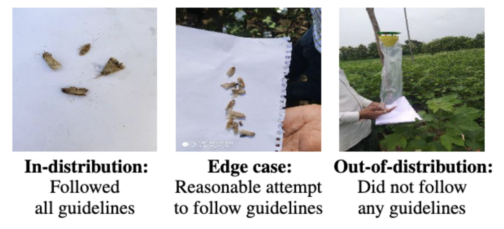
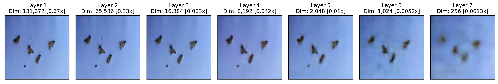
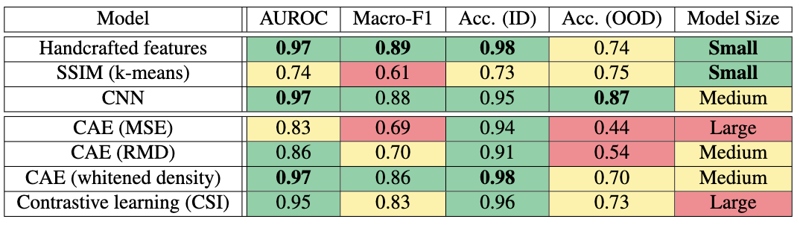

# Out-of-Distribution Image Detection for AI-Based Pest Management App

* Affiliation: Harvard University John A. Paulson School of Engineering and Applied Sciences and the Institute for Applied Computational Science (IACS)
* Authors: Austin Nguyen, Erin Tomlinson, Eric Helmold, Aloysius Lim, Molly Liu 
* Fall 2022

We introduce a repository for out-of-distribution (OOD) detection in partnership with Wadhwani AI.

# Overview  

Wadhwani AI is an independent, nonprofit institute developing AI-based solutions for underserved communities in developing countries. They build and deploy AI solutions in partnership with local governments and civil society organizations to improve large-scale public programs. One such partnership is in the area of pest management for cotton farms. Cotton is the most important fiber and a cash crop for India, providing about 6 million farmers with a direct livelihood and 40-50 million people work in the cotton trade. Small-holder farmers, accounting for 75% of total production, struggle with uncertainty in yield and income. Cotton is exceptionally vulnerable to pest attacks, with bollworms responsible for an estimated 70% of all pest damage. Bollworms destroy the seed coats of the plant, which turns into harvestable cotton, despite heavy pesticide usage. While there have been some advances in GMO cotton called Bt-cotton, which naturally produces pyrethroids that repel insects, in many regions of the world, bollworms have over time developed resistance to these chemicals and they are no longer effective deterrents. Wadhwani AI has developed a mobile phone application named CottonAce that helps cotton farmers identify bollworms in their fields. Bollworms are a pernicious pest for cotton farmers across the world, requiring consistent monitoring and expert decision making to properly address. The CottonAce app provides such support by using machine learning computer vision technologies to identify and count bollworms in photos taken by farmers to track infestations and generate recommendations based on what is found.

Our project goal is to identify and implement one or more effective solutions to the problem of out-of-distribution image detection, allowing the app to reject errant images with minimal processing overhead. Searching for a solution that is deployable in resource constrained environments i.e. without internet connectivity and with limited computing resources, is an important aspect of our task in addition to model accuracy since the end users are often in remote locations and using devices that would be inadequate to run computationally prohibitive models. Therefore, another key part of our modeling analysis will be to remain cognizant of the deployment constraints of our target audience and look for solutions that minimize the computational resources required to run them.

# Data Preparation 

<p align="center">

</p>
We sorted the open-source data set provided by Wadhwani AI into 3 categories: in-distribution (ID), edge case (EC), and out-of-distribution (OOD). We define these categories according to the CottonAce app guidance which outlines how users of the app should take a photo of the suspected pests. The guidelines specify that the contents of a pheromone trap from a farm field should be emptied onto a clean, blank, white sheet of paper and for the photo to be taken from above, in good lighting and with the paper taking up the entirety of the image. We sorted the images of the data set into these 3 categories according to how well each matched the specifications outlined in the app guideline. 

Images most closely adhering to protocol were placed in the ID set and those that were mostly compliant with the guidelines, but for some noticeable, non-overwhelming deviations were placed in the ED set. Most often, an image would be classified as EC instead of ID if the piece of paper holding the contents of the pheromone trap was not the entirety of the image and there was noticeable background content around the paper edges also captured by the image. A label of OOD was ascribed to any image that too meaningfully deviated from the app photo guidelines e.g. not using a piece of paper as a background for the bug trap contents, off topic image content such as an image of the farm field itself.

Functionality to download the open-source image data set and sort images into ID/EC/OOD categories is included in this repository.

# Usage 

## Data Set-up 

1. Follow instructions [here](https://github.com/WadhwaniAI/pest-management-opendata) to download Wadhwani AI's Open Data on Pest Management. 
2. Run command in terminal window:

```
cd ood-detection
python etl_setup.py --src_repo /path/to/opendata 
```

This command does the following:

1. organizes opendata images into ID/EC/OOD folders
2. resizes images to 256px images
3. implements a 90/10 train-test split
4. creates two versions of train-test split: bollworms-* and bollworms-clean-* (* = train, test). 

**Note:** The bollworms-* dataset considers EC as part of ID (introducing variation in the set of ID images). The bollworms-clean-* dataset considers EC as part of OOD (ensuring set of ID images is as clean as possible). 

## External datasets

We tested our OOD detection methods on external datasets:
* [Stanford dogs](http://vision.stanford.edu/aditya86/ImageNetDogs/)
* [102 Flowers](https://www.robots.ox.ac.uk/~vgg/data/flowers/102/)

## Methods

We explored 7 techniques: 3 supervised, 3 unsupervised, 1 contrastive learning. Code and results for each technique can be found under the `notebooks` folder. Example outputs from our convolutional autoencoder (CAE) are shown below.



### Training

To train the autoencoder, run the following command (or see `notebooks/train_cae.ipynb`):

```
cd ood-detection
python train_cae.py
```

Run `python train_cae.py --help` for a detailed list of input arguments.

# Results



**Take-aways**
1. Supervised models (rows 1-3) demonstrate strong performance on specific types of OOD images, but unsupervised/semi-supervised models (rows 4-7) may generalize better.
2. In supervised setting, handcrafted features can achieve comparable performance to CNN with dramatically reduced model size, making it highly preferable on mobile platforms.
3. Image features discovered by CAE can be improved for anomaly detection task by applying a whitening transformation that increases the distance between ID and OOD samples.
4. Contrastive learning (CSI) achieves competitive results out-of-the-box; further exploration of this technique is warranted.
5. Use handcrafted features if model size is a severe constraint. Otherwise, use CNN or CAE (whitened density) if that constraint can be relaxed.

Full details available in our [technical report](ood_detection_pm_technical_report.pdf). 

# License 

MIT License

# Acknowledgements 

We thank our professor Dr. Weiwei Pan for her wonderful mentorship, our course teaching fellows Esther Brown and Marton Havasi for their excellent guidance, and Jerome White and Soma Dhavala from the Wadhwani AI team for their partnership and support throughout. 
